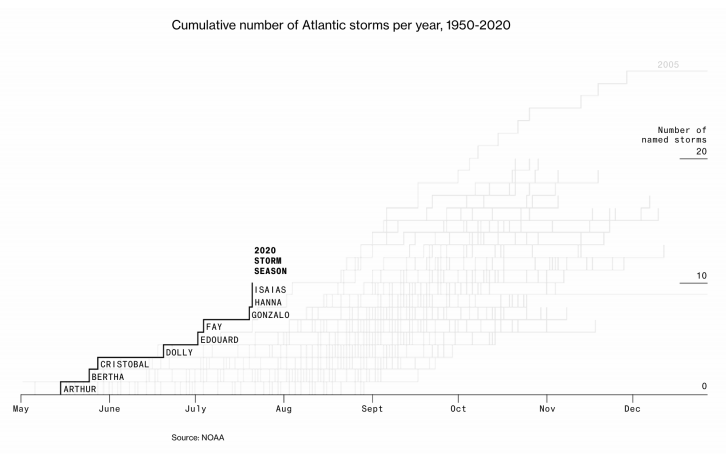
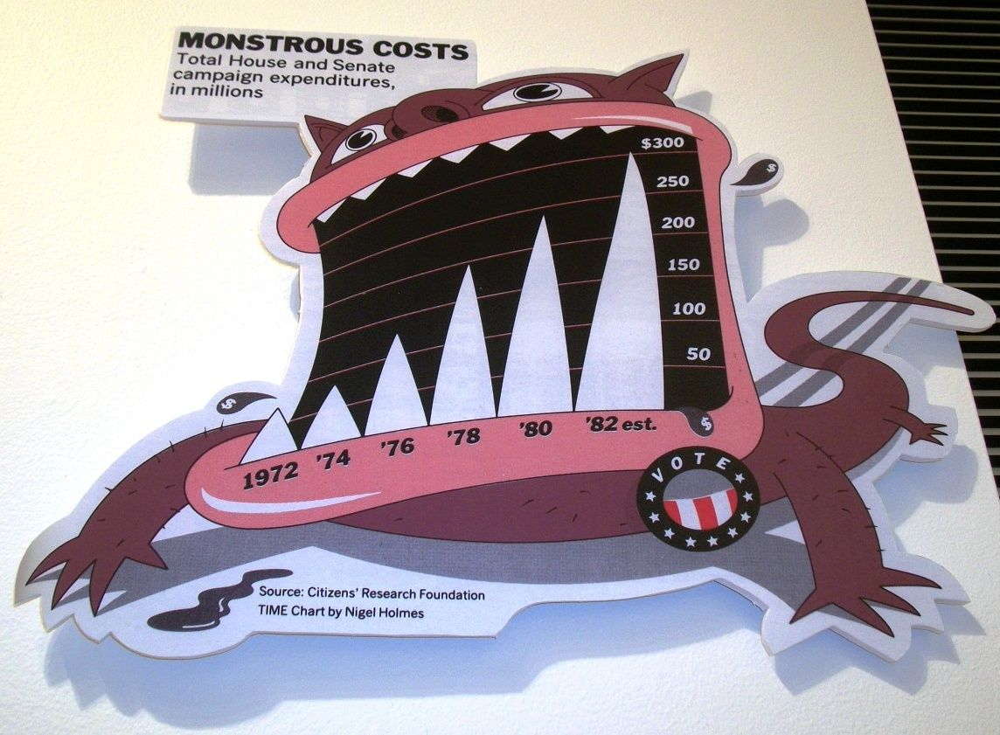
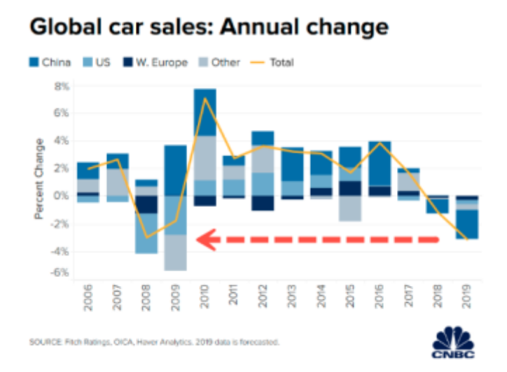
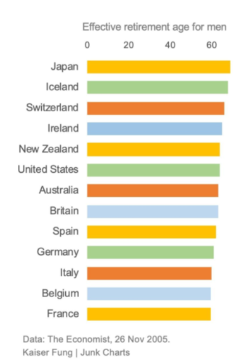

<style type="text/css">

.chart-title {  /* chart_title  */
   font-size: 30px;
   font-family: Arial;
  font-
</style>

```{r setup, include=FALSE}
library(flexdashboard)
```

Row
-----------------------------------------------------------------------

### Assignment 2

Each student will randomly be assigned 4 charts.You have to identify:

- Whether you feel the chart is good or bad
- A criticism of the chart, and
- Ways to improve the chart

Some charts have links to original sources where you might get more insight. Feel free to use them

To see the graphs, click on the slides below and use the left and right arrows to navigate. To see these slides in full size, click here

Row
-----------------------------------------------------------------------

### Solution 2

* **Chart 1**: The chart is good on the whole. It clearly shows the cumulative number of atlantic storms per year from 1950 to 2020 in a graph. The x-axis is month axis and the y-axis represents the number of storms. Although it is not clearly shown in this graph the year of each line represents, considering the the purpose of the graph is to see the overall trend, it is acceptable. Hidden legends can be added to describe the number of storms and year when selected.

* **Chart 2**: Obviously it is eye-catching and the design is interesting. The costs is shown as monster teeth and the monster’s tail is like a dollar sign. The graph demonstrates the increasingly monstrous costs of campaign expenditures vividly. But it may be too fancy in some cases.

* **Chart 3**: Good graph. The graph clearly shows the annual percentage change of global car sales and the contribution of each region. Color is used to differentiate regions and the size of bar can intuitively shows the contribution of different region.

* **Chart 4**: Not a good graph. We can see that the effective retirement age for men of all countries are all above 60, and thus in this selected x-axis, the age difference is too small to give intuitive representation. The origin of the coordinate can be set to 55. Besides, the color used in this graph is just sequentially and does not make sense.


Row {.tabset .tabset-fade }
-------------------------------------

### Chart 1

```{r echo=FALSE}

```


### Chart 2

```{r echo=FALSE}

```

### Chart 3

```{r echo=FALSE}

```

### Chart 4

```{r echo=FALSE}

```
